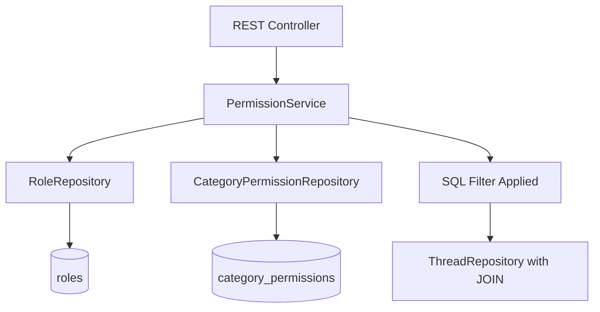
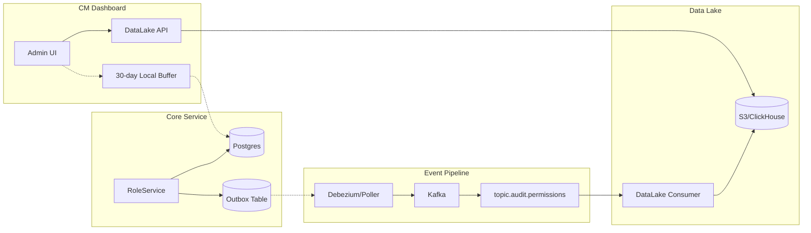

# PRD: Private Communities & RBAC (Phase 6)

## 1. Feature Overview

### Goal

Allow Community Managers (CMs) to create **Private Spaces** visible only to specific members (e.g., "Gold Members", "Moderators").

### Scope

| Feature | Description |
|---------|-------------|
| Private Categories | Categories restricted to specific roles |
| Private Threads | Individual threads with role-based access |
| Invite-Only Tenants | Entire communities requiring membership approval |

---

## 2. User Stories

### Community Manager Stories

- **As a CM**, I want to create a "VIP" Role and assign it to specific users
- **As a CM**, I want to set a Category to be viewable only by "VIP" users
- **As a CM**, I want to see an Audit Log of who accessed or changed private settings

### Member Stories

- **As a Member**, I want to see only content I have permission to access
- **As a Member**, I want to request access to private categories

---

## 3. Technical Architecture

### Database Schema

#### `roles` Table

```sql
CREATE TABLE roles (
    id UUID PRIMARY KEY,
    tenant_id VARCHAR(255) NOT NULL,
    name VARCHAR(100) NOT NULL,
    permissions JSONB,  -- e.g., {"can_moderate": true, "can_invite": false}
    created_at TIMESTAMP WITH TIME ZONE DEFAULT NOW(),
    UNIQUE(tenant_id, name)
);
```

#### `member_roles` Table (Link Table)

```sql
CREATE TABLE member_roles (
    id UUID PRIMARY KEY,
    member_id UUID NOT NULL REFERENCES members(id),
    role_id UUID NOT NULL REFERENCES roles(id),
    assigned_at TIMESTAMP WITH TIME ZONE DEFAULT NOW(),
    assigned_by UUID REFERENCES members(id),
    UNIQUE(member_id, role_id)
);
```

#### `category_permissions` Table

```sql
CREATE TABLE category_permissions (
    id UUID PRIMARY KEY,
    category_id UUID NOT NULL REFERENCES categories(id),
    role_id UUID NOT NULL REFERENCES roles(id),
    action VARCHAR(20) NOT NULL CHECK (action IN ('READ', 'WRITE', 'MODERATE')),
    UNIQUE(category_id, role_id, action)
);
```

### The "Invisible Filter" Strategy

> [!CAUTION]
> **NEVER filter in memory** (loading all threads then hiding them). This leaks metadata and is inefficient.

**MUST filter in SQL:**

```sql
SELECT t.* FROM threads t
JOIN categories c ON t.category_id = c.id
LEFT JOIN category_permissions cp ON c.id = cp.category_id
WHERE c.is_public = true
   OR cp.role_id IN (:userRoleIds)
ORDER BY t.created_at DESC;
```

### Implementation Layers



---

## 4. Security & Auditing

> [!NOTE]
> Audit is a **distributed system problem**, not just a table definition. This section defines the event-driven architecture for scalable, compliant audit logging.

### 4.1 Architecture: The Audit Data Lake

**Decision:** We will **NOT** store long-term audit history in the operational Core database (Postgres).

**Reasoning:**

- Audit logs are high-volume, append-only data
- Storing billions of rows in the transactional DB will degrade performance
- Compliance queries span long time ranges (7+ years for some regulations)
- Separation allows independent scaling of operational vs. analytical workloads



---

### 4.2 The Write Path (Transactional Outbox)

**Mechanism:** When a Permission/Role change occurs:

1. **`RoleService`** executes the change in Postgres
2. **Within the same transaction**, inserts an event into the local `outbox_events` table
3. **Publisher** (Debezium CDC or Polling Service) moves events to Kafka, we should be able to reuse the existing OutboxEventPublisher
4. **Consumer** (DataLake Project) persists to long-term storage

#### Event Payload Schema

```json
{
  "eventType": "PERMISSION_CHANGED",
  "eventId": "uuid-v4",
  "timestamp": "2025-12-09T23:50:00Z",
  "tenantId": "tenant-123",
  "actor": {
    "id": "user_123",
    "email": "admin@example.com",
    "ip": "192.168.1.1"
  },
  "target": {
    "type": "ROLE",
    "id": "role_vip",
    "name": "VIP Members"
  },
  "action": "ROLE_ASSIGNED",
  "diff": {
    "before": { "members": ["user_a"] },
    "after": { "members": ["user_a", "user_b"] }
  },
  "metadata": {
    "userAgent": "Mozilla/5.0...",
    "sessionId": "sess_abc123"
  }
}
```

#### Kafka Topic Structure

| Topic | Purpose |
|-------|---------|
| `topic.audit.permissions` | Role/Permission changes |
| `topic.audit.access` | Break-glass and private content access |
| `topic.audit.content` | Content moderation actions |

---

### 4.3 The Read Path (CM Dashboard)

For Community Managers to view "Recent Activity":

| Use Case | Data Source | Latency |
|----------|-------------|---------|
| Last 30 days | Local Postgres buffer | < 100ms |
| Historical (30+ days) | DataLake API query | 1-5s |
| Compliance export | DataLake batch job | Minutes |

**Implementation:**

```java
@Service
public class AuditQueryService {
    
    public List<AuditEntry> getRecentActivity(String tenantId, int days) {
        if (days <= 30) {
            // Fast path: query local rolling buffer
            return localAuditRepository.findRecent(tenantId, days);
        } else {
            // Slow path: query DataLake API
            return dataLakeClient.queryAuditLogs(tenantId, days);
        }
    }
}
```

---

### 4.4 Auditable Actions

| Action | Trigger | Severity |
|--------|---------|----------|
| `ROLE_CREATED` | New role created | INFO |
| `ROLE_DELETED` | Role deleted | WARN |
| `ROLE_ASSIGNED` | Role assigned to member | INFO |
| `ROLE_REVOKED` | Role removed from member | INFO |
| `PERMISSION_GRANTED` | Permission added to category | INFO |
| `PERMISSION_REVOKED` | Permission removed | WARN |
| `BREAK_GLASS_ACCESS` | Super Admin accessed private content | **CRITICAL** |

---

### 4.5 "Break-Glass" Access Policy

> [!IMPORTANT]
> Super Admins (Platform Owners) can access private data for legal compliance, **but**:

1. Action **MUST** trigger a `BREAK_GLASS_ACCESS` event with severity `CRITICAL`
2. Event **MUST** include justification reason (required field)
3. System **MUST** send real-time notification to affected CM
4. All break-glass events route to dedicated `topic.audit.access` with alerting
5. Events **MUST** be retained for minimum 7 years (compliance)

---

## 5. Legal & Compliance Notes

> [!WARNING]
> Terms of Service must explicitly clarify:

**"Private" means private from other community members, NOT private from Platform Administration.**

### Required TOS Language
>
> Content marked as "private" or posted in private categories is hidden from other community members by default. However, Platform administrators retain the ability to access all content for purposes including but not limited to: safety reviews, legal compliance, abuse prevention, and law enforcement requests. All administrative access to private content is logged and auditable.

### GDPR Considerations

- Private content is subject to standard data retention policies
- Members can request export of their private posts
- Deletion requests apply to private content equally

---

## 6. Implementation Phases

### Phase 6.1: Core RBAC

- [ ] Create `roles` table and entity
- [ ] Create `member_roles` link table
- [ ] Implement `RoleService` for CRUD operations
- [ ] Add role management endpoints to Admin API

### Phase 6.2: Category Permissions

- [ ] Create `category_permissions` table
- [ ] Implement SQL-based filtering in `ThreadRepository`
- [ ] Update `CategoryService` with permission awareness
- [ ] Add permission management UI components

### Phase 6.3: Audit System

- [ ] Create `audit_logs` table
- [ ] Implement `AuditService` with async logging
- [ ] Add audit interceptors for permission changes
- [ ] Create audit log viewer in Admin Dashboard

### Phase 6.4: Break-Glass & Compliance

- [ ] Implement break-glass access flow
- [ ] Add justification requirement for admin access
- [ ] Create compliance reporting endpoints
- [ ] Document TOS requirements
